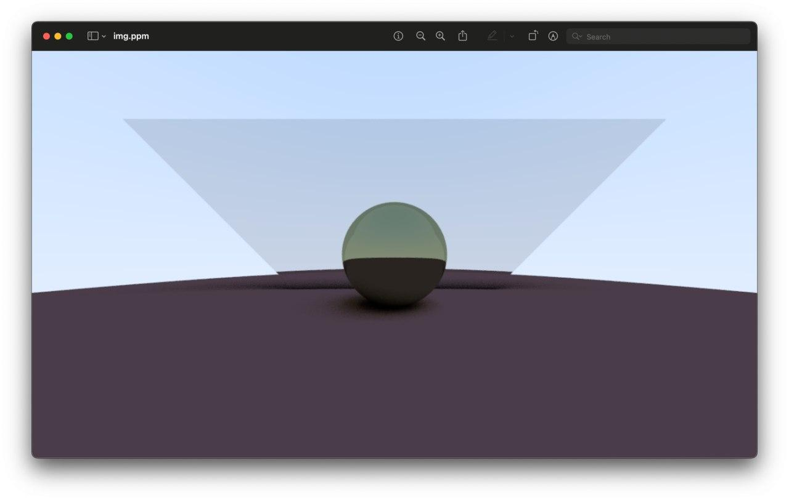

# Icarus
Minimalistic path tracer written as a type erasure experiment. The aim was to get familiar with general concept of path/ray tracing and try to achive dynamic polymorphism without use of inheritence in c++.

### Render


### Type Erasure polymorphism 

```c++
template <class T>
concept Hittable = requires(T t, Ray const& ray, RayHitBounds const& bounds) {
  { CheckHit(t, ray, bounds) } -> std::same_as<std::optional<HitRecord>>;
};

template <class T>
concept HittablePtr =
    std::is_pointer_v<T> && Hittable<std::remove_pointer_t<T>>;

class HittableProxy {
  using RedirectSig = std::optional<HitRecord>(void const*, Ray const&,
                                               RayHitBounds const&);
  using RedirectSigPtr = std::add_pointer_t<RedirectSig>;

 public:
  template <HittablePtr T>
  HittableProxy(T&& t)
      : impl_([](void const* repr, Ray const& ray,
                 RayHitBounds const& bounds) -> std::optional<HitRecord> {
          return CheckHit(*static_cast<T>(repr), ray, bounds);
        }),
        obj_ptr_(t) {}

  [[nodiscard]] auto operator()(Ray const& ray,
                                RayHitBounds const& bounds) const noexcept {
    return impl_(obj_ptr_, ray, bounds);
  }

 private:
  RedirectSigPtr impl_;
  void const* obj_ptr_;
};
```
